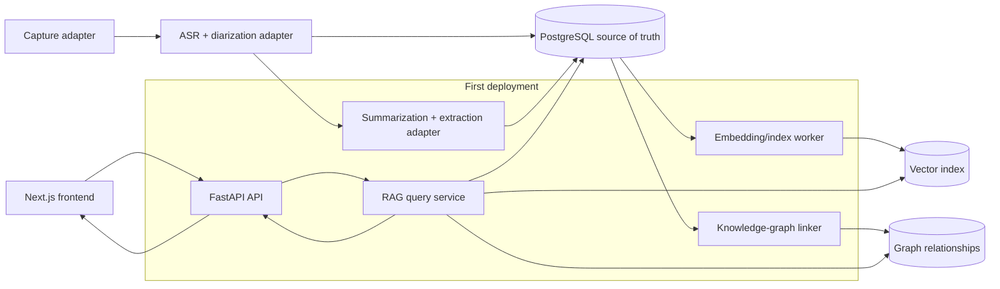
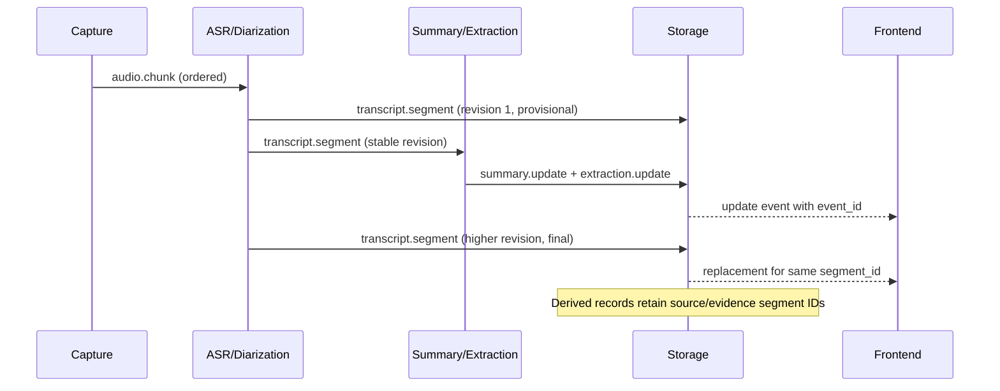
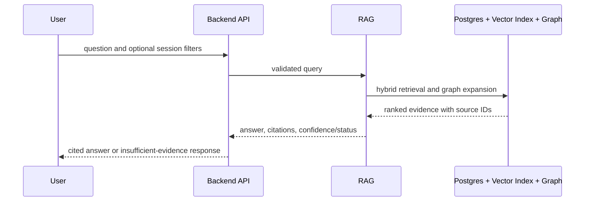
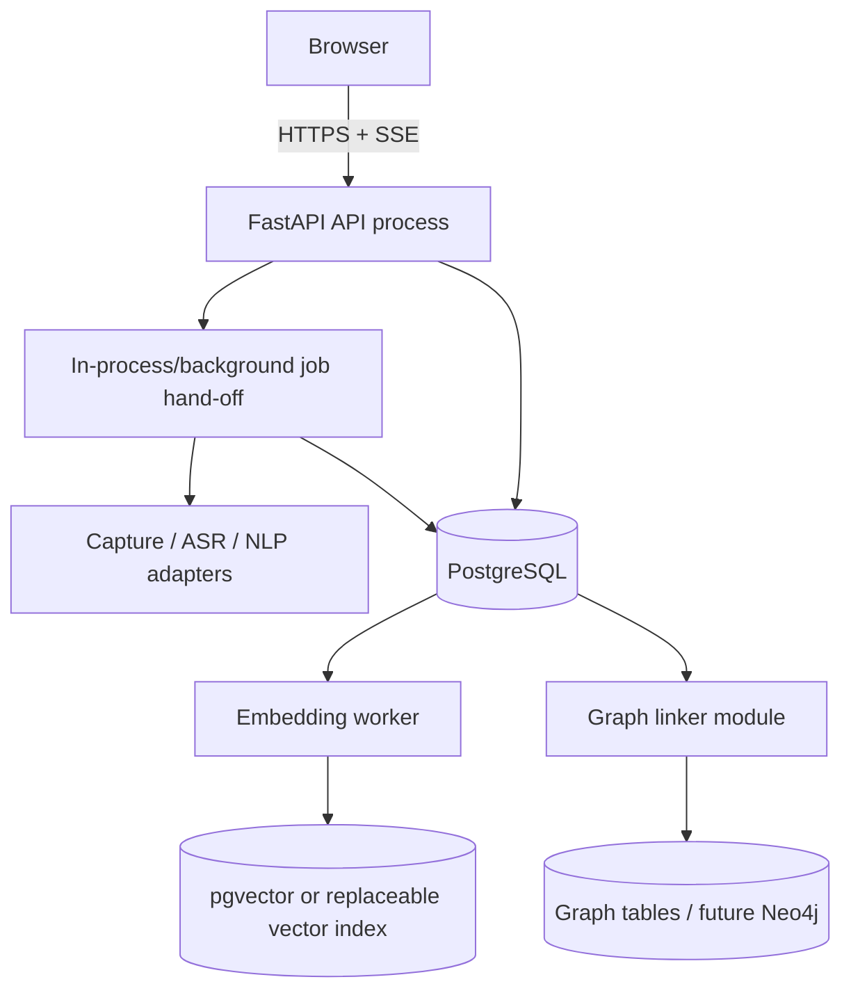

"""
Week 03 (24-08-2026 - 30-08-2026)
Task: Draft architecture docs and component diagrams

Why this matters:
The Week 2 boundaries need a single visual representation that the team and
faculty can use to check data ownership and evidence flow. These diagrams
become the reference for API alignment in Week 4 and architecture sign-off in
Week 5.

What this script does:
This design note documents the logical components, first deployment shape,
live-update and historical-query flows, and evidence lineage that later API
contracts must preserve. The diagrams are source text for team review and a
thesis appendix.
"""

# Week 3 — architecture documentation and diagrams

## Architecture documentation scope

The diagrams describe logical boundaries, not six independently deployed
microservices. For the first implementation, Dev's FastAPI process may host
the API and background workers while the contracts remain transport-neutral.
This keeps the system explainable for a faculty review and leaves room to
split out a slow provider later without changing payload ownership.

## Component diagram

The first-deployment box is an implementation choice, not a data contract:
each logical component still accepts and emits the versioned envelope from
Week 2.

## Live meeting update flow

## Historical question flow

## Deployment view

This deployment is intentionally modest. A queue, separate workers, or a
managed vector service can replace the in-process hand-off later because the
event envelope and IDs are stable. No diagram implies that the graph is the
canonical store for transcript text.

## Storage model at this stage

PostgreSQL stores sessions, transcript segments, summary versions, extracted
records, and citation provenance. The vector index stores embeddings for
searchable records and references their canonical IDs. The graph stores
relationships such as `PERSON MENTIONED_IN SESSION`, `ACTION_ITEM OWNED_BY
PERSON`, and `DECISION SUPPORTED_BY SEGMENT`. It does not become an alternate
copy of raw transcript data.

## Evidence lineage

| Stage | Durable identifier | Must point back to |
| --- | --- | --- |
| Audio chunk | `chunk_id` | `session_id`, capture time, and audio reference |
| Transcript segment | `segment_id` + `revision` | `session_id`, timing, speaker label |
| Summary version | `summary_id` + `version` | `source_segment_ids` |
| Extracted item | `item_id` | `evidence_segment_ids` |
| Graph relationship | `relationship_id` | source/target records and evidence IDs |
| RAG citation | record ID plus segment timing | the stored evidence record |

An update may replace the text for a `segment_id`, but it never silently
creates a second identity for the same logical segment. This lets live
corrections remain traceable in historical answers.

## Assumptions for early fixtures

- Audio, ASR, and LLM providers are swappable adapters, not architecture
  dependencies.
- Speaker labels may be anonymous (for example, `SPEAKER_00`) until identity
  resolution is available.
- Search and answer generation must return an explicit insufficient-evidence
  result instead of inventing a response.

## Open decisions carried into Week 4

1. Confirm whether the external frontend receives updates through SSE first;
   WebSockets remain an option if bidirectional controls become necessary.
2. Confirm the canonical persisted summary field name. This architecture uses
   `source_segment_ids`; provider-native `covered_segment_ids` can be mapped by
   the NLP adapter without changing storage.
3. Confirm whether Dev stores graph relationships in PostgreSQL initially or
   provisions Neo4j. RAG must call a graph interface either way.

## WEEK OUTPUT CONTRACT

**Input:** Week 2 service and payload boundaries.

**Output:** Reusable component and sequence diagrams plus a storage-role
statement. The diagrams describe the expected chain for the eventual weekly
integration demo.
